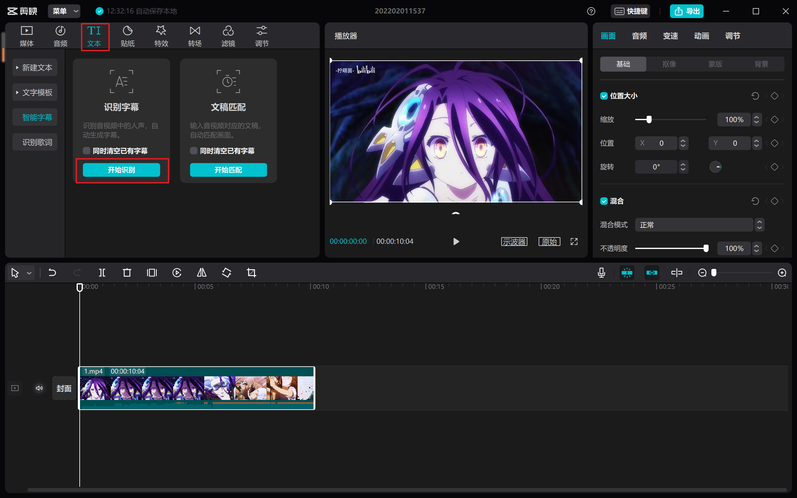

### 版本

剪映专业版>=2.6.0

### 设置路径

Windows剪映专业版自动生成的字幕文件一般在

```
C:\Users\xxx\AppData\Local\JianyingPro\User Data\Projects\com.lveditor.draft\xxx\draft_content.json
```

使用前请用记事本之类的打开`srt.py`，修改`PATH = r"修改r和双引号里面的内容"`，保存退出

#### 绝对路径

`PATH = r"C:\xxx\xxx\draft_content.json"`

#### 相对路径

把`srt.py`复制或者移动到与剪映生成的`draft_content.json`同一个目录，修改成`PATH = "draft_content.json"`

### 使用

先将视频导入剪映专业版



#### Windows

双击start.bat或者在`srt.py`所在路径[打开命令行窗口](https://gitee.com/djj45/asoul/blob/master/ffmpeg.md#%E5%9C%A8%E6%9F%90%E4%B8%80%E7%9B%AE%E5%BD%95%E4%B8%8B%E4%BD%BF%E7%94%A8ffmpeg)，输入`python srt.py`，回车

#### MAC

在`srt.py`所在路径打开命令行窗口，输入`python srt.py`，回车

**生成的srt文件路径与`srt.py`所在路径一样**

